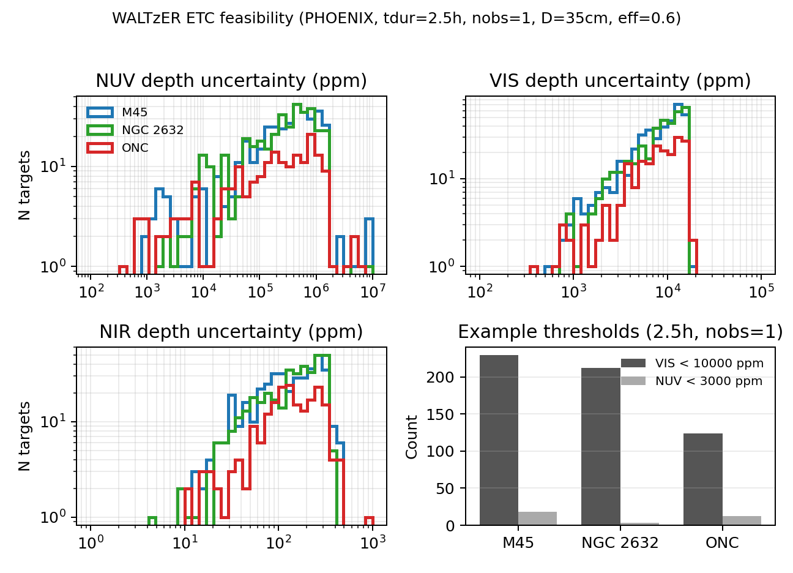

# WALTzER Science Theme Summary — Stellar characterization (draft)

## High-level science summary
We will characterize stellar photospheres, activity, and circumstellar environments using **simultaneous space-based NUV spectroscopy (0.24–0.32 μm), VIS spectroscopy (0.425–0.797 μm), and NIR photometry (0.9–1.6 μm)**. The core goal is to deliver a homogeneous, multi-band, time-resolved atlas of stellar radiation environments that:

- Calibrates **flare and activity energetics** beyond what optical-only surveys can provide, enabling robust UV irradiance estimates for exoplanet atmospheric escape/photochemistry and for stellar magnetic evolution studies.
- Measures **accretion/outflow diagnostics in young stars** (T Tauri / Herbig) while tracking contemporaneous continuum changes, addressing rapid variability that otherwise biases non-simultaneous UV+optical observations.
- Provides uniform stellar reference spectra for exoplanet and stellar-population science, including support for Ariel/JWST stellar characterization and cluster-based age/activity benchmarks.

## Why WALTzER is uniquely suitable
- **NUV access from space:** below ~300–320 nm is strongly limited from the ground by atmospheric absorption; WALTzER provides routine access to the 240–320 nm window.
- **True simultaneity across bands:** activity, accretion, and extinction vary on minutes–days; simultaneous NUV+VIS(+NIR) avoids cross-epoch systematics.
- **Homogeneous survey capability:** a single facility provides consistent spectral resolution (**R ≈ 3000** in NUV and VIS; NIR is photometry) and stable spectrophotometry across a broad target set.

## Core science (transmission + emission/reflection spectroscopy support)
**Stellar contamination and variability** are limiting systematics for exoplanet atmosphere retrievals. WALTzER provides contemporaneous stellar monitoring that can be used to:

- Build **NUV-to-optical flare color/energy calibrations** to translate CHEOPS/TESS optical flare monitoring into physically-motivated UV irradiance histories.
- Deliver **activity diagnostics** (e.g., Mg II h&k at 2796/2803 Å in NUV; Balmer lines and He I in VIS) to inform priors on stellar heterogeneity and time-variable line emission during exoplanet observations.
- Provide **benchmark stellar SEDs** (photospheric + activity) for targets of major exoplanet missions, enabling consistent cross-mission comparisons.

## Secondary science / consortium surveys (candidate public surveys)
**A. Nearby cluster time-domain survey (public):** obtain multi-band time series for members of nearby clusters spanning age:
- **ONC (~Myr):** accretion + flares in PMS stars, plus massive-star irradiation fields.
- **Pleiades M45 (~125 Myr):** young active dwarfs; flare statistics in a well-studied benchmark.
- **Praesepe NGC 2632 (~600–800 Myr):** mid-age activity decay and rotation–activity benchmarks.

**B. Exoplanet host star characterization (consortium):** repeat visits for a curated list (Ariel/JWST overlap, temperate small-planet hosts), prioritizing simultaneous activity diagnostics and variability budgets.

**C. Rare/complex objects (consortium):** e.g., Herbig Ae/Be, Be/B[e]-like systems where NUV line forests plus optical emission lines constrain hot circumstellar gas while NIR photometry tracks dust contributions.

## Feasibility with WALTzER (illustrative ETC simulations)
We ran the WALTzER ETC on Gaia-selected members in M45, NGC 2632, and ONC assuming **2.5 h** integrations (single visit) and PHOENIX photospheric templates (no reddening applied). The figure below summarizes the achieved depth uncertainties by band; a substantial fraction of cluster members are feasible in VIS for modest precision, while NUV feasibility is restricted to the brightest/least-extincted stars.

**Caveat:** ONC extinction and accretion-related NUV excess are not yet modeled; NUV feasibility in ONC requires a reddening+excess forward model to define robust target subsets.

## Targets (example list and availability)
We have produced a reproducible target-selection pipeline (Gaia DR3 query + basic crowding metric + Sun-angle visibility) and example target lists for:
- **M45 (Pleiades)**
- **NGC 2632 (Praesepe)**
- **ONC (Orion Nebula Cluster)**

The 2026 visibility windows computed to date are Sun-angle-only and should be treated as first-order planning constraints.

## Observing time needed (order-of-magnitude)
An initial public cluster survey could target **O(10^2)** stars per cluster with **~2–3 h** per visit and **3–5 visits** per target (variability + flare statistics), i.e. **~0.6–1.5 ks-hours** total for three clusters depending on cadence and depth. A complementary exoplanet-host program would focus on smaller, higher-cadence samples.

## References (starter list)
- Accretion diagnostics across UV/optical/NIR lines: Alcalá et al. (2014, A&A).
- UV excess / accretion rate calibration: Calvet & Gullbring (1998, ApJ); Gullbring et al. (1998, ApJ); Herczeg & Hillenbrand (2008, ApJ).
- Nearly simultaneous UV+optical accretion studies: Ingleby et al. (2013, ApJ).
- NUV flare emission modeling: Brasseur et al. (2022, ApJ); Kowalski et al. (2024, ApJ).

